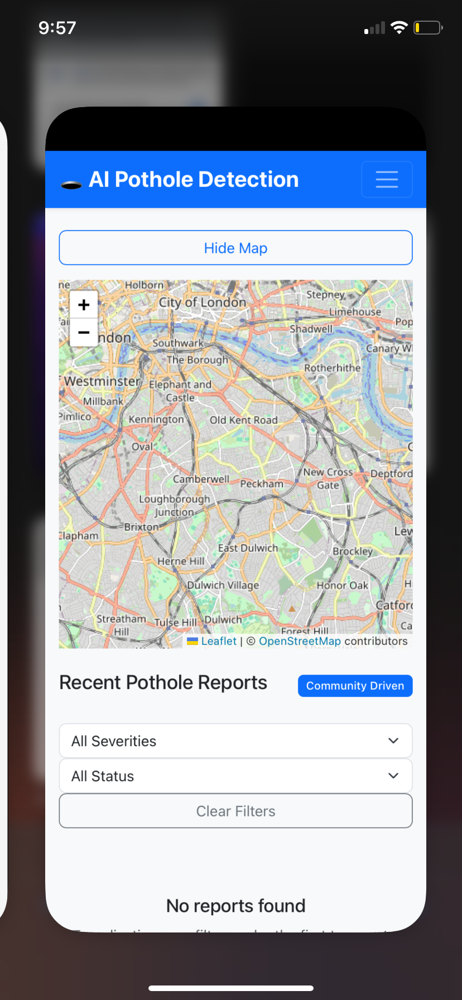

# 🕳️ AI Pothole Detection Community

A full-stack web application that uses artificial intelligence to detect and report potholes in communities. This project combines React frontend with Flask backend and YOLOv8 computer vision for automated pothole detection.

---

## 🚀 Features

### 🎯 Frontend (React)
- 🔐 **User Authentication** - JWT-based login/register system  
- 🤖 **AI Image Analysis** - Upload images for automatic pothole detection using YOLOv8  
- 🗺️ **Interactive Map** - Leaflet-based map with real-time pothole reporting  
- ⚡ **Real-time Updates** - Socket.IO for live comments and voting  
- 📊 **Analytics Dashboard** - Charts and statistics for pothole data  
- 📱 **Responsive Design** - Bootstrap-powered mobile-first interface  
- 👥 **Community Features** - Voting, commenting, and report verification  

### 🔧 Backend (Flask)
- 🛠️ **RESTful API** - CRUD operations for reports, comments, and users  
- 🤖 **AI Integration** - YOLOv8 for object detection  
- ⚡ **Socket.IO** - Real-time updates  
- 🗄️ **SQLite Database** - Efficient and lightweight  
- 📁 **File Handling** - Uploads, thumbnails, and annotations  
- 🔒 **JWT Authentication** - Secure access  

---

## 🛠️ Tech Stack

### Frontend
| Technology | Purpose |
|------------|----------|
| React | UI Framework |
| Bootstrap | Responsive Styling |
| React Router | Navigation |
| Axios | API Calls |
| Socket.IO | Real-Time Communication |
| Leaflet | Map Visualization |
| Chart.js | Data Visualization |

### Backend
| Technology | Purpose |
|------------|----------|
| Flask | Web Framework |
| YOLOv8 | AI Object Detection |
| SQLite | Database |
| JWT | Authentication |

---

## 📁 Project Structure

ai-pothole-detection/  
├── 🐍 backend/  
│   ├── `app.py` - Main Flask application  
│   ├── `potholes.db` - SQLite database  
│   ├── `static/`  
│   │   ├── `uploads/` - Original uploaded images  
│   │   └── `thumbs/` - Generated thumbnails  
│   └── `requirements.txt` - Python dependencies  

├── ⚛️ frontend/  
│   ├── `public/`  
│   │   └── `index.html` - HTML template  
│   ├── `src/`  
│   │   ├── `components/` - Reusable React components  
│   │   ├── `pages/` - Page components  
│   │   ├── `context/` - React context providers  
│   │   ├── `utils/` - Helper functions and API  
│   │   ├── `App.js` - Main App component  
│   │   └── `index.js` - React entry point  
│   ├── `package.json` - Node.js dependencies  
│   └── `.env` - Environment variables  

└── `README.md`

---

## 🚀 Quick Start

### Prerequisites
- 🟢 Node.js 16+  
- 🐍 Python 3.8+  
- 🔧 Git  

### 🧠 Full Setup Commands

#### 1️⃣ Clone Repository
\`\`\`bash
git clone https://github.com/your-username/ai-pothole-detection.git
cd ai-pothole-detection
\`\`\`

#### 2️⃣ Backend Setup
\`\`\`bash
cd backend
python -m venv venv
source venv/bin/activate    # Windows: venv\Scripts\activate
pip install -r requirements.txt
python app.py
\`\`\`
✅ Backend running at: [http://localhost:5000](http://localhost:5000)

#### 3️⃣ Frontend Setup
\`\`\`bash
cd ../frontend
npx create-react-app ./
npm install axios bootstrap react-router-dom socket.io-client leaflet chart.js react-chartjs-2
touch .env
\`\`\`

Add environment variables to `.env`:
\`\`\`env
REACT_APP_API_BASE_URL=http://localhost:5000
REACT_APP_SOCKET_URL=http://localhost:5000
\`\`\`

Start frontend:
\`\`\`bash
npm start
\`\`\`
✅ Frontend running at: [http://localhost:3000](http://localhost:3000)

---

## 🔌 API Endpoints

| Method | Endpoint | Description | Auth |
|--------|----------|------------|------|
| POST   | `/api/register`      | Register new user | ❌ |
| POST   | `/api/login`         | Login           | ❌ |
| GET    | `/api/reports`       | Get all reports | ❌ |
| POST   | `/api/report`        | Create new report | ✅ |
| POST   | `/api/analyze-image` | Analyze image   | ✅ |
| GET    | `/api/comments`      | Fetch comments  | ❌ |
| POST   | `/api/comment`       | Add comment     | ✅ |
| POST   | `/api/vote`          | Vote on report  | ✅ |
| GET    | `/api/stats`         | Community stats | ❌ |

---

## 🗃️ Database Schema

### 👥 Users Table
- `id` INTEGER - Primary key  
- `username` TEXT - Unique username  
- `email` TEXT - Unique email  
- `password_hash` TEXT - Hashed password  
- `role` TEXT - user/admin  
- `created_at` TEXT - Account creation timestamp  

### 📋 Reports Table
- `id` INTEGER - Primary key  
- `user_id` INTEGER - Foreign key to users  
- `text` TEXT - Report description  
- `lat/lon` REAL - GPS coordinates  
- `severity` TEXT - Pothole severity level  
- `image_url` TEXT - Original image path  
- `ai_conf` REAL - AI confidence score  

---

## 🤝 Contributing

- 🍴 Fork the repository  
- 🌿 Create a feature branch  
- 💾 Commit changes  
- 📤 Push & open a Pull Request  

---

## 📝 License

MIT License

---

## 🙏 Acknowledgments

- 🎯 YOLOv8 by Ultralytics  
- 🗺️ OpenStreetMap  
- 🎨 Bootstrap  
- ⚛️ React community  

---

## 🗺️ Roadmap

- 📱 Mobile App Development  
- 🤖 AI Model Retraining  
- 🏛️ Government Integration APIs  
- 🌍 Multi-language Support  
- 📈 Advanced Analytics  
- 🔔 Push Notifications  

---

## 🎨 Screenshots

### 🔐 Authentication
┌──────────────────────────────┐  
│ 🕳️ AI Pothole Detection      │  
│ Email: [___________]         │  
│ Password: [_________]        │  
│ [ Login ] [ Register ]       │  
└──────────────────────────────┘  

### 🗺️ Dashboard
┌────────────────────────────────────────────┐  
│ Navbar: Home | Map | Reports | Dashboard   │  
├──────────────┬──────────────────────────────┤  
│ 📊 Stats     │ 🗺️ Map + Reports            │  
│ 📸 Upload    │ [Pothole Markers]           │  
│ 🤖 AI Result │ 👍 Votes 👎 Reports          │  
└──────────────┴──────────────────────────────┘  

### 📊 Analytics
┌──────────────────────────────┐  
│ Reports: ████████ 85         │  
│ Users:   ██████ 42           │  
│ AI Conf: █████ 78%           │  
└──────────────────────────────┘  

### 📊 Project Status

⭐ Built with ❤️ for safer communities and better roads 🛣️  
© 2025 AI Pothole Detection Community
